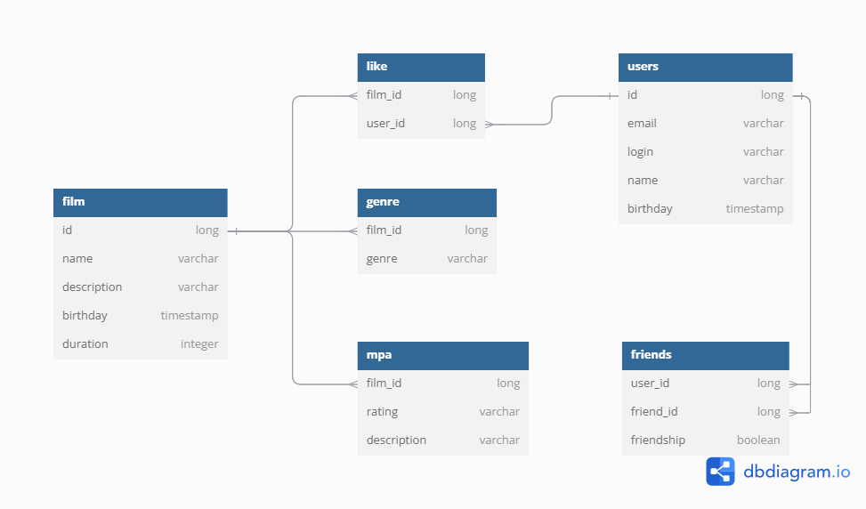

# java-filmorate
Template repository for Filmorate project.

# Схема бд


# Примеры запросов

- [ ] Вывести всех пользователей
    ```
    select *
    from users        
    ```
- [ ] Вывести имена всех пользователей и их друзей, у которых дружба подтверждена
    ```
    select u.name, u2.name 
    from users u      
    join friends f on f.iser_id = u.id
    join users u2 on u2.id = f.friend_id
    where friendship = true
    ```
- [ ] Вывести 10 самых продолжительных фильмов
    ```
    select *
    from film
    order by duration desc
    limit 10        
    ```
- [ ] Вывести пользователя по ид
    ```
    select *
    from film        
    wheer id = #{id}
    ```
